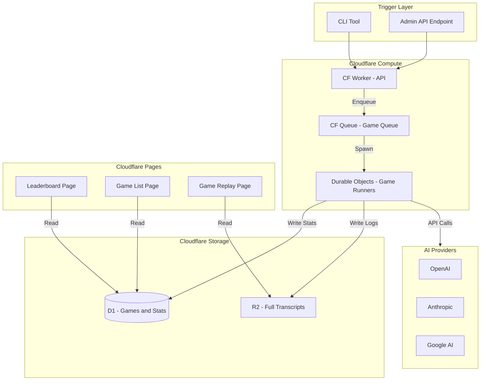
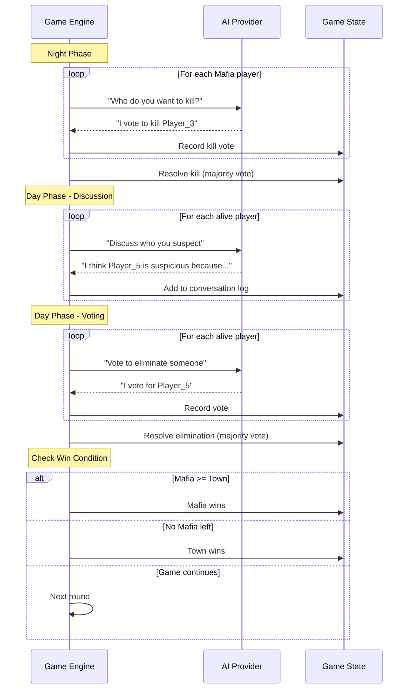

# Mafia Arena - Complete Project Goals

## Executive Summary

**Mafia Arena** is a public demo/portfolio project that benchmarks Large Language Models by having them play the social deduction game Mafia against each other. The system tracks win rates, displays results on a leaderboard, and exposes full game transcripts for transparency.

---

## Decisions Summary

| Category | Decision |

|----------|----------|

| **Project Name** | Mafia Arena |

| **Scale** | Demo/Portfolio |

| **Infrastructure** | Cloudflare-native (Workers, D1, R2, Queues, Durable Objects) |

| **Player Count** | Configurable per game |

| **Roles** | Mafia + Villager only (no special roles) |

| **Discussion Phase** | Yes - AIs discuss before voting |

| **Model List** | Fixed, curated by you |

| **API Keys** | Your keys only |

| **Matchup Style** | Homogeneous teams (Mafia = Model A, Town = Model B) |

| **Sample Size** | 10-50 games per matchup |

| **Triggering** | Manual only |

| **Concurrency** | 10+ simultaneous games |

| **AI Failure Handling** | Retry with backoff (up to 3 attempts) |

| **Leaderboard View** | Role-based (separate Mafia/Town rankings) |

| **Transparency** | Full debug (prompts, responses, tokens) |

| **UI Style** | Minimal, data-focused |

| **Access** | Fully public |

| **MVP Priority** | Games running reliably first |

---

## System Architecture



---

## Core Components

### 1. Game Engine (Pure TypeScript)

A framework-agnostic game engine that can run a Mafia game to completion.

**Responsibilities:**

- Manage game state (players, phase, round)
- Execute game loop (Night -> Day -> Vote -> Elimination)
- Call AI agents for discussion and voting
- Determine win condition

**Key Design:**

- No Cloudflare dependencies (portable, testable)
- Accepts an "AI caller" interface (dependency injection)
- Returns structured game result
```typescript
interface GameConfig {
  playerCount: number;          // e.g., 5, 7, 9
  mafiaCount: number;           // e.g., 1, 2
  models: ModelAssignment[];    // Which model plays which role
  maxRounds: number;            // Safety limit
}

interface ModelAssignment {
  modelId: string;              // e.g., "gpt-4o", "claude-3-5-sonnet"
  team: "mafia" | "town";
  count: number;                // How many players of this model
}

interface GameResult {
  id: string;
  config: GameConfig;
  winner: "mafia" | "town";
  rounds: number;
  transcript: GameEvent[];
  tokenUsage: TokenUsage;
  durationMs: number;
}
```


### 2. Durable Object - Game Runner

Wraps the game engine and handles the async, long-running nature of AI calls.

**Responsibilities:**

- Receive game config from queue
- Run game engine with retry logic for AI calls
- Write results to D1 and R2
- Self-terminate after completion

**Lifecycle:**

```
1. Queue delivers message with GameConfig
2. DO initializes game state
3. DO runs game loop:
   - Call AI for each player action
   - Retry up to 3x on failure with exponential backoff
   - Update internal state
4. Game ends -> Write to D1 (stats) and R2 (transcript)
5. DO hibernates/deletes
```

### 3. D1 Database Schema

```sql
-- AI Models registry
CREATE TABLE models (
  id TEXT PRIMARY KEY,           -- e.g., "gpt-4o"
  provider TEXT NOT NULL,        -- "openai", "anthropic", "google"
  display_name TEXT NOT NULL,    -- "GPT-4o"
  config JSON,                   -- Model-specific config
  created_at INTEGER NOT NULL
);

-- Game metadata (lightweight)
CREATE TABLE games (
  id TEXT PRIMARY KEY,
  config_hash TEXT NOT NULL,     -- Hash of game config for grouping
  player_count INTEGER NOT NULL,
  mafia_count INTEGER NOT NULL,
  winner TEXT NOT NULL,          -- "mafia" or "town"
  rounds INTEGER NOT NULL,
  duration_ms INTEGER NOT NULL,
  total_tokens INTEGER NOT NULL,
  created_at INTEGER NOT NULL
);

-- Per-game model participation
CREATE TABLE game_participants (
  id TEXT PRIMARY KEY,
  game_id TEXT NOT NULL REFERENCES games(id),
  model_id TEXT NOT NULL REFERENCES models(id),
  team TEXT NOT NULL,            -- "mafia" or "town"
  player_count INTEGER NOT NULL, -- How many players this model had
  won BOOLEAN NOT NULL
);

-- Aggregated leaderboard (updated after each game)
CREATE TABLE leaderboard (
  model_id TEXT NOT NULL REFERENCES models(id),
  team TEXT NOT NULL,            -- "mafia" or "town"
  games_played INTEGER NOT NULL DEFAULT 0,
  games_won INTEGER NOT NULL DEFAULT 0,
  win_rate REAL GENERATED ALWAYS AS (
    CASE WHEN games_played > 0 THEN CAST(games_won AS REAL) / games_played ELSE 0 END
  ) STORED,
  total_tokens INTEGER NOT NULL DEFAULT 0,
  updated_at INTEGER NOT NULL,
  PRIMARY KEY (model_id, team)
);

-- Indexes for common queries
CREATE INDEX idx_games_created ON games(created_at DESC);
CREATE INDEX idx_participants_model ON game_participants(model_id);
CREATE INDEX idx_leaderboard_winrate ON leaderboard(team, win_rate DESC);
```

### 4. R2 Storage Structure

```
/games/
  {game_id}/
    transcript.json     # Full game log with all events
    
# transcript.json structure:
{
  "gameId": "abc123",
  "config": { ... },
  "events": [
    {
      "type": "phase_start",
      "phase": "night",
      "round": 1,
      "timestamp": 1234567890
    },
    {
      "type": "ai_call",
      "playerId": "player_1",
      "modelId": "gpt-4o",
      "prompt": { "system": "...", "user": "..." },
      "response": "...",
      "tokensUsed": { "input": 500, "output": 100 },
      "latencyMs": 1200
    },
    {
      "type": "discussion",
      "playerId": "player_1",
      "message": "I think player_3 is suspicious..."
    },
    {
      "type": "vote",
      "playerId": "player_1",
      "votedFor": "player_3"
    },
    {
      "type": "elimination",
      "playerId": "player_3",
      "role": "villager"
    },
    ...
  ],
  "result": {
    "winner": "mafia",
    "rounds": 3,
    "survivors": ["player_1", "player_5"]
  }
}
```

### 5. API Endpoints (CF Workers)

```
POST /api/games/run
  Body: { 
    count: number,           // How many games to run
    config: GameConfig       // Game configuration
  }
  Response: { queued: number, batchId: string }

GET /api/games
  Query: ?limit=20&offset=0
  Response: { games: GameSummary[], total: number }

GET /api/games/:id
  Response: { game: GameSummary, transcriptUrl: string }

GET /api/leaderboard
  Query: ?team=mafia|town
  Response: { rankings: LeaderboardEntry[] }

GET /api/models
  Response: { models: Model[] }
```

### 6. Frontend Pages (CF Pages)

**`/` - Leaderboard**

- Two tables: "Best Mafia Players" and "Best Town Players"
- Columns: Rank, Model, Games, Wins, Win Rate
- Clean, minimal design with good typography

**`/games` - Game List**

- Reverse chronological list of completed games
- Shows: Models involved, Winner, Rounds, Date
- Click to view replay

**`/games/:id` - Game Replay**

- Timeline view of game events
- Expandable sections for each round
- Full transparency: Show prompts and responses
- Token usage breakdown

**`/about` - How It Works**

- Explanation of the benchmark methodology
- List of participating models
- Links to source code

---

## Game Flow Detail



---

## AI Prompt Strategy

**System Prompt (per player):**

```
You are playing Mafia. You are a {ROLE} on the {TEAM} team.

Your goal: {GOAL}

Current game state:
- Round: {ROUND}
- Phase: {PHASE}
- Alive players: {PLAYER_LIST}
- Dead players: {DEAD_LIST}

{TEAM_SPECIFIC_INFO}

Respond in JSON format.
```

**Discussion Prompt:**

```
Based on the conversation so far, share your thoughts. 
Try to identify who might be Mafia (if Town) or deflect suspicion (if Mafia).

Conversation history:
{HISTORY}

Respond with: { "message": "your discussion contribution" }
```

**Vote Prompt:**

```
It's time to vote. Based on the discussion, choose who to eliminate.
You may vote for any alive player except yourself, or abstain.

Respond with: { "vote": "player_id" } or { "vote": null }
```

---

## Error Handling

| Error Type | Handling |

|------------|----------|

| AI Timeout | Retry up to 3x with exponential backoff (1s, 2s, 4s) |

| AI Rate Limit | Retry after rate limit window, max 3 attempts |

| AI Invalid Response | Parse error -> retry with clarified prompt |

| AI Repeated Failures | After 3 failures, abort game, mark as "error" in D1 |

| DO Crash | Queue retry delivers message to new DO instance |

---

## Milestones

### M1: Game Engine Core

- Pure TypeScript game engine
- No external dependencies except AI caller interface
- Unit tests for all game logic
- Can run a complete game given mock AI responses

### M2: Durable Object Wrapper

- DO that runs the game engine
- Handles AI retries with backoff
- Writes results to D1 and R2
- Hibernation after completion

### M3: Queue and API

- CF Queue for game scheduling
- Worker API endpoints for triggering games
- Batch game creation

### M4: Database and Stats

- D1 schema implementation
- Stats aggregation after each game
- Leaderboard queries

### M5: Frontend MVP

- Leaderboard page with role-based rankings
- Game list page
- Basic game replay view

### M6: Full Transparency

- Show prompts and responses in replay
- Token usage breakdown
- Cost calculation

### M7: Polish and Deploy

- Error handling improvements
- Rate limiting
- Production deployment
- Documentation

---

## Success Criteria

The project is successful when:

1. **Reliability:** 95%+ of triggered games complete without errors
2. **Performance:** Average game completes in under 3 minutes
3. **Transparency:** Any game can be fully audited (prompts, responses, decisions)
4. **Accessibility:** Leaderboard loads in under 2 seconds worldwide
5. **Cost:** Stays within Cloudflare free tier for typical usage

---

## Ready to Build?

This document defines the complete scope of Mafia Arena. The next step is to begin **Milestone 1: Game Engine Core** - a clean, testable TypeScript implementation of the Mafia game logic.

Shall I proceed with implementation?