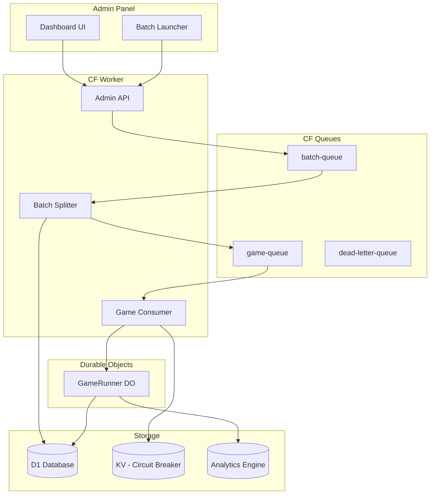

# Batch Processing System & Admin Panel

## Current State Analysis

Your existing infrastructure is well-positioned for scaling:

- **Queue System**: Already using CF Queues (`GAME_QUEUE`) with DLQ
- **Durable Objects**: `GameRunner` handles individual games with idempotency
- **Cost Tracking**: [`frontend/src/lib/costs.ts`](frontend/src/lib/costs.ts) has batch pricing ready
- **Gap**: No batch tracking, no admin panel, limited to 100 games/request

## Architecture Overview



---

## Phase 1: Database Schema

Add batch tracking and analytics tables.**New Migration**: `migrations/0008_batch_tracking.sql`

```sql
-- Batch job tracking
CREATE TABLE batches (
  id TEXT PRIMARY KEY,
  name TEXT,
  status TEXT DEFAULT 'queued' CHECK (status IN ('queued', 'processing', 'completed', 'cancelled', 'paused')),
  total_games INTEGER NOT NULL,
  completed_games INTEGER DEFAULT 0,
  failed_games INTEGER DEFAULT 0,
  config_json TEXT NOT NULL,
  estimated_cost_usd REAL,
  actual_cost_usd REAL DEFAULT 0,
  created_by TEXT DEFAULT 'api',
  created_at INTEGER DEFAULT (unixepoch()),
  started_at INTEGER,
  completed_at INTEGER
);

-- Daily aggregated stats for fast dashboard queries
CREATE TABLE daily_stats (
  date TEXT PRIMARY KEY,
  games_completed INTEGER DEFAULT 0,
  games_failed INTEGER DEFAULT 0,
  tokens_used INTEGER DEFAULT 0,
  cost_usd REAL DEFAULT 0,
  updated_at INTEGER DEFAULT (unixepoch())
);

-- Indexes for admin queries
CREATE INDEX idx_batches_status ON batches(status);
CREATE INDEX idx_batches_created ON batches(created_at DESC);
CREATE INDEX idx_games_batch_status ON games(batch_id, status);
```

---

## Phase 2: Hierarchical Queue System

### A. Add Batch Queue

Update [`wrangler.toml`](wrangler.toml):

```toml
# Batch Queue - receives large job requests
[[queues.producers]]
queue = "mafia-arena-batches"
binding = "BATCH_QUEUE"

[[queues.consumers]]
queue = "mafia-arena-batches"
max_batch_size = 1
max_batch_timeout = 5

# Game Queue - individual games (increase concurrency)
[[queues.consumers]]
queue = "mafia-arena-games"
max_batch_size = 10
max_batch_timeout = 30
max_retries = 3
max_concurrency = 50  # Run 50 games in parallel
dead_letter_queue = "mafia-arena-dlq"

# Enable Smart Placement for cost optimization
[placement]
mode = "smart"
```


### B. Circuit Breaker Pattern

Use KV to pause/resume batch processing:

```typescript
// In worker - check before processing
const isPaused = await env.RATE_LIMIT.get('SYSTEM_PAUSED');
if (isPaused === 'true') {
  message.retry({ delaySeconds: 60 }); // Check again in 60s
  return;
}
```

---

## Phase 3: Admin API Endpoints

Add to [`src/worker/index.ts`](src/worker/index.ts):| Endpoint | Method | Description |

|----------|--------|-------------|

| `/api/admin/batches` | POST | Create batch (up to 10,000 games) |

| `/api/admin/batches` | GET | List batches with progress |

| `/api/admin/batches/:id` | GET | Batch details with live stats |

| `/api/admin/batches/:id/cancel` | POST | Cancel batch |

| `/api/admin/system/pause` | POST | Pause all processing |

| `/api/admin/system/resume` | POST | Resume processing |

| `/api/admin/stats/live` | GET | Real-time metrics |

| `/api/admin/estimate` | POST | Cost estimate for config |

### Cost Estimation API

```typescript
// POST /api/admin/estimate
{
  config: GameConfig,
  count: number,
  useBatchAPI: boolean  // 50% cheaper but 24h delay
}
// Returns: { estimatedCost, tokensPerGame, timeEstimate }
```

---

## Phase 4: Analytics Engine Integration

Add Analytics Engine for real-time metrics without D1 load.Update [`wrangler.toml`](wrangler.toml):

```toml
[[analytics_engine_datasets]]
binding = "ANALYTICS"
dataset = "mafia_events"
```

Log events in `GameRunner`:

```typescript
// After game completion
env.ANALYTICS.writeDataPoint({
  blobs: [modelA, modelB, winner, batchId],
  doubles: [rounds, durationMs, totalTokens, costUsd],
  indexes: [batchId]
});
```

Query for dashboard:

- Games/minute by batch
- Cost velocity
- Win rates in real-time

---

## Phase 5: Admin Frontend

Create [`frontend/src/pages/admin/`](frontend/src/pages/admin/) with:

### Pages Structure

```javascript
frontend/src/pages/admin/
├── index.astro          # Dashboard overview
├── batches/
│   ├── index.astro      # List all batches
│   ├── new.astro        # Launch new batch
│   └── [id].astro       # Batch details
└── system.astro         # System controls (pause/resume)
```


### Dashboard Features

1. **Live Metrics Panel**: Games running, queue depth, cost today
2. **Batch Progress**: Progress bars, ETA, success/failure rates  
3. **Cost Tracker**: Daily/weekly/monthly spend with budget alerts
4. **Quick Actions**: Launch preset matchups, pause system

### Batch Launcher Form

- Model A vs Model B selector (from `/api/models`)
- Player count / Mafia count
- Game count slider (1 - 10,000)
- **Live cost estimate** (updates as you configure)
- Batch API toggle (cheaper but delayed)
- Name/description field

---

## Phase 6: Cost Optimization Strategies

### A. Batch AI APIs (50% savings)

The providers already have different pricing. For high-volume runs:

- OpenAI Batch API
- Anthropic Message Batches  
- Google Batch

Update AI providers to support batch mode flag.

### B. Parallel Introduction Phase

Modify [`src/engine/phases/IntroductionPhase.ts`](src/engine/phases/IntroductionPhase.ts) to use `Promise.all()` for concurrent player introductions (reduces DO wall-clock time).

### C. Smart Concurrency

- Start with `max_concurrency = 25` 
- Monitor error rates
- Scale up to 100 if providers handle it

---

## Implementation Order

1. **Database migration** - Add batches table
2. **Queue infrastructure** - Batch queue + consumer logic
3. **Circuit breaker** - KV-based pause/resume
4. **Admin API** - CRUD for batches + system controls
5. **Analytics Engine** - Real-time metrics
6. **Admin UI** - Dashboard and batch launcher
7. **Cost optimization** - Batch API support

---

## Key Files to Modify

| File | Changes |

|------|---------|

| [`wrangler.toml`](wrangler.toml) | Add batch queue, analytics engine, smart placement |

| [`src/worker/index.ts`](src/worker/index.ts) | Add admin API routes, batch queue consumer |

| [`src/worker/types.ts`](src/worker/types.ts) | Add BatchConfig, AdminStats types |

| [`src/worker/GameRunner.ts`](src/worker/GameRunner.ts) | Add Analytics Engine logging |

| [`frontend/src/lib/costs.ts`](frontend/src/lib/costs.ts) | Add batch estimation function |

## Questions Before Implementation

1. **Authentication**: Should admin panel be protected? (API key, Cloudflare Access, or public?)
2. **Budget limit**: What's the max daily spend you want to enforce?